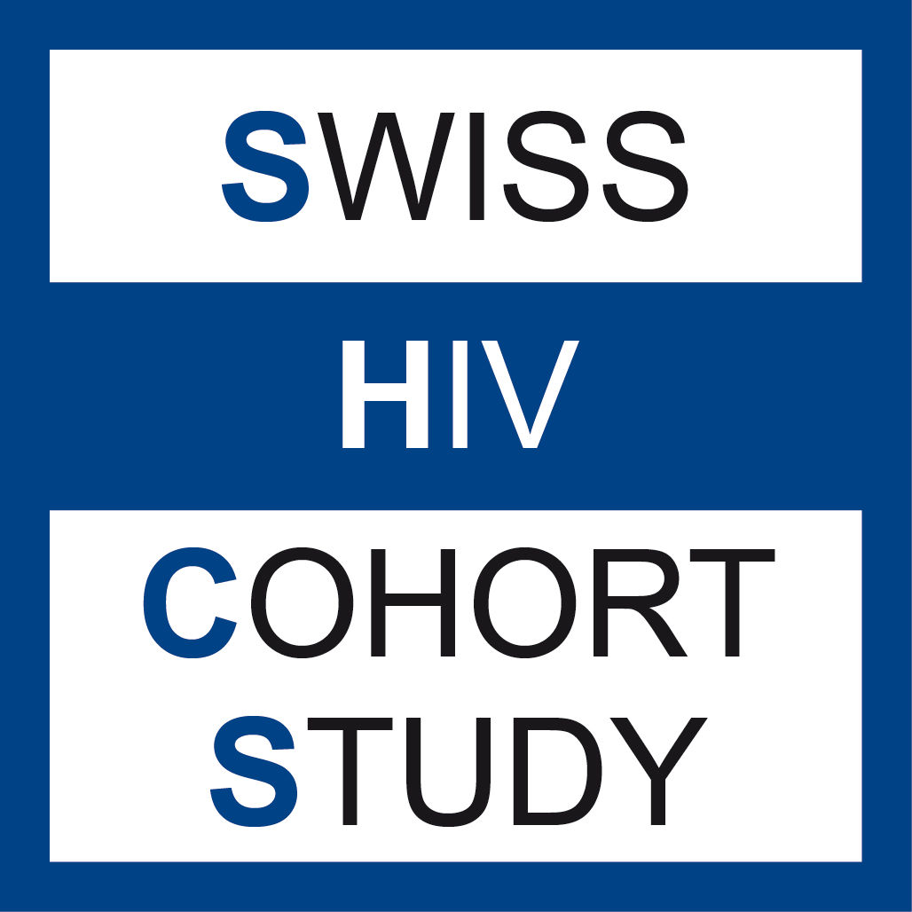

**ADHD-HIV-PrEP is a cross-sectional survey nested within the Swiss
HIV Cohort Study (SHCS) and the SwissPrEPared cohort. The goal of
this study is to estimate how common attention-deficit/hyperactivity
disorder (ADHD) traits are among people living with HIV and among
people taking HIV pre-exposure prophylaxis (PrEP) in Switzerland.**

People living with HIV experience disproportionately high rates of
mental health challenges, yet adult ADHD is largely absent from the
HIV literature. Traits associated with ADHD, together with social
exclusion, adverse life events, stigma, and barriers to accessing
healthcare, may increase vulnerability to HIV acquisition and
complicate adherence to treatment and prevention. A comparable
pathway may apply to people using PrEP. Prevalence data on ADHD in
people living with HIV are limited to two small-scale studies, and no
data exist for PrEP users.

 

Over a 12-month recruitment period, participants attending routine
visits will complete a short, validated ADHD screening questionnaire
(the ASRS-5). Screening data will be linked to routinely collected
cohort data to describe sociodemographic, behavioural and clinical
patterns associated with ADHD traits.

 

The study is co-created and co-led by people who, alongside their
academic and clinical practice, have experiential knowledge of the
topics being explored.

 

The ADHD-HIV-PrEP study will be conducted at the following sites:

-   Checkpoint Zurich

-   University Hospital Lausanne (CHUV)

-   University Hospital Zurich (USZ)

 

This study is nested within two established Swiss research
platforms, the Swiss HIV Cohort Study and SwissPrEPared, and is
funded by a nested-project grant of the SHCS and a Gilead Fellowship.

::: {style="background-color: #f0f0f0; padding: 1rem; text-align: center; margin-top: 4rem;"}

:::
